# Especificación del Módulo POS - Kubit

## 1. Descripción General
El módulo **POS (Point of Sale)** es el núcleo transaccional del ecosistema Kubit. Gestiona ventas presenciales, control de caja, inventario, compras, facturación electrónica (DIAN) y finanzas mensuales para PYMES colombianas.

### 1.1 Alcance Funcional
- Registro de ventas con múltiples métodos de pago
- Apertura y cierre de cajas registradoras
- Control de inventario (entradas, salidas, ajustes)
- Compras a proveedores
- Facturación electrónica (cumplimiento DIAN)
- Gestión de clientes y proveedores
- Catálogo de productos con variantes
- Dashboard financiero mensual
- Control de acceso basado en roles (RBAC)

### 1.2 Dependencias
- **Base de datos:** PostgreSQL vía Supabase (esquema `pos_*`)
- **UI/UX:** Sistema de diseño definido en `05-ui-ux-system.md`
- **Arquitectura:** Estructura definida en `ARCHITECTURE.md`

---

## 2. Modelo de Datos

### 2.1 Convenciones Generales
- **Prefijo:** Todas las tablas usan prefijo `pos_`
- **Primary Key:** `id` tipo `string` (UUID v4)
- **Timestamps:** `created_at` y `updated_at` tipo `timestamptz`
- **Soft Delete:** `deleted_at` nullable (`timestamptz`)
- **Auditoría:** `created_by` y `updated_by` como FK a `pos_usuarios`
- **Moneda:** Todos los montos son `numeric`
- **Índices:** Todas las FK deben tener índice para rendimiento en JOINs

### 2.2 Diagrama Entidad-Relación

```mermaid
erDiagram
    pos_caja_apertura {
        string id PK
        string caja_id FK
        string cajero_id FK
        timestamp fecha_apertura
        timestamp fecha_cierre
        text observaciones
        numeric monto_inicial
        numeric monto_final
        numeric monto_esperado
        numeric diferencia
        string estado
        timestamp created_at
        timestamp updated_at
        string created_by FK
        string updated_by FK
        timestamp deleted_at
    }

    pos_cajas {
        string id PK
        string nombre
        string sucursal_id FK
        text descripcion
        boolean activa
        timestamp created_at
        timestamp updated_at
        string created_by FK
        string updated_by FK
        timestamp deleted_at
    }

    pos_categorias {
        string id PK
        string nombre
        text descripcion
        string color
        boolean activa
        timestamp created_at
        timestamp updated_at
        string created_by FK
        string updated_by FK
        timestamp deleted_at
        string codigo
        string categoria_padre_id FK
    }

    pos_clientes {
        string id PK
        string tipo_id
        string numero_id
        string primer_nombre
        string segundo_nombre
        string primer_apellido
        string segundo_apellido
        string direccion
        string ciudad
        string departamento
        string telefono
        string celular
        string email
        date fecha_nacimiento
        string genero
        boolean activo
        text notas
        timestamp created_at
        timestamp updated_at
        string created_by FK
        string updated_by FK
        timestamp deleted_at
    }

    pos_compras {
        string id PK
        int numero_orden
        string proveedor_id FK
        string usuario_id FK
        date fecha_compra
        date fecha_entrega
        string estado
        numeric subtotal
        numeric impuesto
        numeric descuento
        numeric total
        text notas
        timestamp created_at
        timestamp updated_at
        string created_by FK
        string updated_by FK
        timestamp deleted_at
    }

    pos_compras_detalle {
        string id PK
        string compra_id FK
        string producto_detalle_id FK
        int cantidad
        numeric precio_unitario
        numeric descuento
        numeric tasa_impuesto
        numeric subtotal
        numeric impuesto
        numeric total
        timestamp created_at
        string updated_by FK
        timestamp deleted_at
    }

    pos_configuracion_empresa {
        string id PK
        string nombre_empresa
        string nit
        text direccion
        string telefono
        string email
        string sitio_web
        string resolucion_dian
        int rango_desde
        int rango_hasta
        numeric impuesto_default
        string moneda
        string zona_horaria
        timestamp created_at
        timestamp updated_at
        string created_by FK
        string updated_by FK
        date fecha_vencimiento_resolucion
        string prefijo_facturacion
        text logo_url
        text mensaje_legal
        timestamp deleted_at
    }

    pos_facturacion {
        string id PK
        string venta_id FK
        string tipo_comprobante
        string serie
        string numero
        date fecha_emision
        string moneda
        string condicion_venta
        int dias_credito
        string cliente_id FK
        string cliente_tipo_id
        string cliente_numero_id
        string cliente_nombre
        string cliente_direccion
        string cliente_email
        string cliente_telefono
        numeric subtotal
        numeric impuesto
        numeric total
        string estado
        timestamp created_at
        timestamp updated_at
        string created_by FK
        string updated_by FK
        timestamp deleted_at
    }

    pos_finanzas_mensuales {
        string id PK
        int anio
        int mes
        numeric ventas_brutas
        numeric devoluciones
        numeric descuentos
        numeric ventas_netas
        numeric costo_mercaderia_vendida
        numeric gastos_operativos_total
        numeric inversion_marketing
        numeric otros_ingresos
        numeric otros_gastos
        numeric utilidad_bruta
        numeric utilidad_neta
        numeric roi_calculado
        text notas
        timestamp created_at
        timestamp updated_at
        string created_by FK
        string updated_by FK
        timestamp deleted_at
        numeric compras_total
        numeric costos_comision_total
    }

    pos_gasto_categorias {
        string id PK
        string nombre
        text descripcion
        boolean activa
        timestamp created_at
        timestamp updated_at
        string created_by FK
        string updated_by FK
        timestamp deleted_at
    }

    pos_gastos_mensuales_detalle {
        string id PK
        int anio
        int mes
        string categoria_id FK
        numeric monto
        text notas
        timestamp created_at
        timestamp updated_at
        string created_by FK
        string updated_by FK
        timestamp deleted_at
        string venta_id FK
    }

    pos_metodos_pago {
        string id PK
        string nombre
        text descripcion
        boolean activo
        timestamp created_at
        timestamp updated_at
        string created_by FK
        string updated_by FK
        timestamp deleted_at
    }

    pos_movimientos_inventario {
        string id PK
        string producto_detalle_id FK
        string tipo_movimiento
        int cantidad
        string motivo
        string referencia
        text notas
        timestamp fecha
        string created_by FK
        timestamp updated_at
        timestamp deleted_at
    }

    pos_permisos {
        string id PK
        string clave
        string descripcion
        string modulo
        timestamp created_at
        timestamp updated_at
    }

    pos_productos {
        string id PK
        string nombre
        string tipo_producto
        string categoria_id FK
        string marca
        string modelo
        text descripcion
        numeric tasa_impuesto
        boolean activo
        timestamp created_at
        timestamp updated_at
        string created_by FK
        string updated_by FK
        timestamp deleted_at
    }

    pos_productos_detalle {
        string id PK
        string producto_id FK
        string codigo_barras
        string codigo_interno
        numeric precio_compra
        numeric precio_venta
        numeric precio_mayorista
        numeric margen_ganancia
        numeric descuento_max
        int stock_actual
        int stock_min
        int stock_max
        numeric peso
        string dimensiones
        jsonb atributos
        timestamp created_at
        timestamp updated_at
        string created_by FK
        string updated_by FK
        timestamp deleted_at
    }

    pos_productos_multimedia {
        string id PK
        string producto_id FK
        string producto_detalle_id FK
        string url
        string tipo
        int orden
        string alt_text
        timestamp created_at
        timestamp updated_at
        string created_by FK
        string updated_by FK
        timestamp deleted_at
    }

    pos_proveedores {
        string id PK
        string tipo_id
        string numero_id
        string razon_social
        string nombre_comercial
        string codigo
        string categoria
        string direccion
        string ciudad
        string departamento
        string telefono
        string celular
        string email
        string sitio_web
        string persona_contacto
        string terminos_pago
        numeric limite_credito
        boolean activo
        text notas
        timestamp created_at
        timestamp updated_at
        string created_by FK
        string updated_by FK
        timestamp deleted_at
    }

    pos_roles {
        string id PK
        string nombre
        string descripcion
        timestamp created_at
        timestamp updated_at
        timestamp deleted_at
    }

    pos_rol_permisos {
        string rol_id PK
        string permiso_id PK
        timestamp created_at
        timestamp updated_at
    }

    pos_sucursales {
        string id PK
        string nombre
        string direccion
        string ciudad
        string departamento
        string telefono
        string email
        boolean activa
        timestamp created_at
        timestamp updated_at
        string created_by FK
        string updated_by FK
        timestamp deleted_at
    }

    pos_usuarios {
        string id PK
        string nombre_completo
        string usuario
        string email
        string telefono
        string documento
        date fecha_nacimiento
        text direccion
        string rol_id FK
        boolean activo
        timestamp ultimo_acceso
        string password_hash
        timestamp created_at
        timestamp updated_at
        string created_by FK
        string updated_by FK
        timestamp deleted_at
    }

    pos_ventas {
        string id PK
        string numero_venta
        string cliente_id FK
        string usuario_id FK
        string canal_id FK
        string referencia_externa
        timestamp fecha_venta
        string metodo_pago
        string estado
        numeric subtotal
        numeric impuesto
        numeric descuento
        numeric total
        numeric costo_cargo_venta
        numeric costo_impuestos
        numeric costo_envios
        text notas
        timestamp created_at
        timestamp updated_at
        string created_by FK
        string updated_by FK
        timestamp deleted_at
    }

    pos_ventas_detalle {
        string id PK
        string venta_id FK
        string producto_detalle_id FK
        int cantidad
        numeric precio_unitario
        numeric descuento
        numeric tasa_impuesto
        numeric subtotal
        numeric impuesto
        numeric total
        timestamp created_at
        string updated_by FK
        timestamp deleted_at
    }

    %% RELATIONSHIPS
    pos_canales_venta ||--o{ pos_ventas : "canal_id"
    pos_usuarios ||--o{ pos_caja_apertura : "cajero_id"
    pos_categorias ||--o{ pos_categorias : "categoria_padre_id"
    pos_usuarios ||--o{ pos_clientes : "created_by"
    pos_usuarios ||--o{ pos_compras : "usuario_id"
    pos_proveedores ||--o{ pos_compras : "proveedor_id"
    pos_compras ||--o{ pos_compras_detalle : "compra_id"
    pos_productos_detalle ||--o{ pos_compras_detalle : "producto_detalle_id"
    pos_usuarios ||--o{ pos_configuracion_empresa : "updated_by"
    pos_ventas ||--|| pos_facturacion : "venta_id"
    pos_usuarios ||--o{ pos_facturacion : "created_by"
    pos_usuarios ||--o{ pos_finanzas_mensuales : "created_by"
    pos_gasto_categorias ||--o{ pos_gastos_mensuales_detalle : "categoria_id"
    pos_ventas ||--o{ pos_gastos_mensuales_detalle : "venta_id"
    pos_productos_detalle ||--o{ pos_movimientos_inventario : "producto_detalle_id"
    pos_usuarios ||--o{ pos_movimientos_inventario : "created_by"
    pos_categorias ||--o{ pos_productos : "categoria_id"
    pos_usuarios ||--o{ pos_productos : "created_by"
    pos_usuarios ||--o{ pos_proveedores : "created_by"
    pos_clientes ||--o{ pos_ventas : "cliente_id"
    pos_usuarios ||--o{ pos_ventas : "usuario_id"
    pos_ventas ||--o{ pos_ventas_detalle : "venta_id"
    pos_productos_detalle ||--o{ pos_ventas_detalle : "producto_detalle_id"
    pos_roles ||--o{ pos_usuarios : "rol_id"
    pos_roles ||--o{ pos_rol_permisos : "rol_id"
    pos_permisos ||--o{ pos_rol_permisos : "permiso_id"
    pos_productos ||--o{ pos_productos_detalle : "producto_id"
    pos_productos ||--o{ pos_productos_multimedia : "producto_id"
    pos_productos_detalle ||--o{ pos_productos_multimedia : "producto_detalle_id"
    pos_usuarios ||--o{ pos_productos_detalle : "created_by"
    pos_usuarios ||--o{ pos_productos_detalle : "updated_by"
    pos_usuarios ||--o{ pos_productos_multimedia : "created_by"
    pos_usuarios ||--o{ pos_productos_multimedia : "updated_by"
    pos_usuarios ||--o{ pos_caja_apertura : "created_by"
    pos_usuarios ||--o{ pos_caja_apertura : "updated_by"
    pos_usuarios ||--o{ pos_configuracion_empresa : "created_by"
    pos_clientes ||--o{ pos_facturacion : "cliente_id"
    pos_cajas ||--o{ pos_caja_apertura : "caja_id"
    pos_sucursales ||--o{ pos_cajas : "sucursal_id"
    pos_usuarios ||--o{ pos_cajas : "created_by"
    pos_usuarios ||--o{ pos_cajas : "updated_by"
    pos_usuarios ||--o{ pos_metodos_pago : "created_by"
    pos_usuarios ||--o{ pos_metodos_pago : "updated_by"
    pos_usuarios ||--o{ pos_sucursales : "created_by"
    pos_usuarios ||--o{ pos_sucursales : "updated_by"
    pos_usuarios ||--o{ pos_compras_detalle : "updated_by"
    pos_usuarios ||--o{ pos_ventas_detalle : "updated_by"
    pos_usuarios ||--o{ pos_facturacion : "updated_by"
```



### 2.3 Catálogo de Tablas

#### 2.3.1 Configuración y Maestros

| Tabla | Propósito | Tipo |
|---|---|---|
| `pos_configuracion_empresa` | Configuración general de la empresa (singleton) | Maestro |
| `pos_sucursales` | Sucursales o puntos de venta | Maestro |
| `pos_cajas` | Cajas registradoras físicas/lógicas | Maestro |
| `pos_metodos_pago` | Catálogo de métodos de pago (Efectivo, Tarjeta, Transferencia, etc.) | Maestro |
| `pos_canales_venta` | Catálogo de canales de venta (físico, web, MercadoLibre, etc.) con columna `tipo` (fisico, web_propio, marketplace) | Maestro |
| `pos_gasto_categorias` | Categorías para clasificación de gastos | Maestro |

#### 2.3.2 Productos e Inventario

| Tabla | Propósito |
|---|---|
| `pos_categorias` | Árbol jerárquico de categorías de productos (autoreferenciada vía `categoria_padre_id`) |
| `pos_productos` | Cabecera del producto (nombre, marca, modelo, impuesto) |
| `pos_productos_detalle` | Variante del producto (código barras, precios, stock, peso, dimensiones, atributos JSON) |
| `pos_productos_multimedia` | Imágenes y archivos multimedia asociados al producto/variante |
| `pos_movimientos_inventario` | Bitácora de movimientos de inventario (entradas, salidas, ajustes) |

#### 2.3.3 Clientes y Proveedores

| Tabla | Propósito |
|---|---|
| `pos_clientes` | Datos maestros de clientes (personas naturales o jurídicas) |
| `pos_proveedores` | Datos maestros de proveedores |

#### 2.3.4 Transaccional

| Tabla | Propósito |
|---|---|
| `pos_caja_apertura` | Sesiones de apertura/cierre de caja |
| `pos_ventas` | Cabecera de ventas |
| `pos_ventas_detalle` | Líneas de detalle de cada venta |
| `pos_compras` | Cabecera de órdenes de compra |
| `pos_compras_detalle` | Líneas de detalle de cada compra |
| `pos_facturacion` | Facturas electrónicas (cumplimiento DIAN) |

#### 2.3.5 Financiero

| Tabla | Propósito |
|---|---|
| `pos_finanzas_mensuales` | Resumen financiero mensual (ventas, costos, gastos, ROI) |
| `pos_gastos_mensuales_detalle` | Detalle de gastos operativos del mes |

#### 2.3.6 Seguridad

| Tabla | Propósito |
|---|---|
| `pos_usuarios` | Usuarios del sistema |
| `pos_roles` | Roles (Administrador, Cajero, Vendedor, etc.) |
| `pos_permisos` | Permisos granulares (catálogo) |
| `pos_rol_permisos` | Asignación de permisos a roles (PK compuesta) |

---

## 3. Reglas de Negocio

### 3.1 Ventas

#### 3.1.1 Ciclo de Vida de una Venta

```
PENDIENTE → CONFIRMADA → FACTURADA → (opcional) ANULADA
```

- **PENDIENTE:** Venta en progreso, no afecta inventario
- **CONFIRMADA:** Venta completada, descuenta inventario
- **FACTURADA:** Venta con factura electrónica emitida
- **ANULADA:** Venta cancelada, reingresa inventario

#### 3.1.2 Reglas de Negocio
1. **Número de venta:** Se genera automáticamente con formato `{prefijo_facturacion}-{año}{mes}-{correlativo}` (ej. `KBT-202605-0001`)
2. **Descuento:** No puede exceder `descuento_max` definido en `pos_productos_detalle`
3. **Stock:** Al confirmar una venta, se valida `stock_actual >= cantidad`. Si no hay stock suficiente, la venta no puede confirmarse
4. **Múltiples métodos de pago:** Una venta puede dividirse entre varios métodos de pago (ej. 50% Efectivo + 50% Tarjeta). Se registra el método principal en `metodo_pago`
5. **Cliente opcional:** Una venta puede registrarse sin cliente (venta al público general)
6. **Margen de ganancia:** Se calcula automáticamente como `((precio_venta - precio_compra) / precio_compra) * 100`

#### 3.1.3 Cálculos Automáticos
```
subtotal = SUM(cantidad * precio_unitario - descuento)
impuesto = subtotal * tasa_impuesto
total = subtotal + impuesto
```

### 3.2 Caja

#### 3.2.1 Ciclo de Vida de una Caja

```
CERRADA → ABIERTA → CERRADA
```

#### 3.2.2 Reglas de Apertura y Cierre
1. **Apertura:** Solo se puede abrir una caja si está en estado `CERRADA`. Se registra `monto_inicial` en efectivo
2. **Cierre:** Al cerrar, se calcula:
   - `monto_esperado = monto_inicial + total_ventas_en_efectivo`
   - `diferencia = monto_final - monto_esperado`
3. **Caja por sesión:** Un usuario solo puede tener una caja abierta a la vez
4. **Cierre forzado:** Un administrador puede cerrar una caja de forma forzada si el cajero no puede hacerlo

### 3.3 Inventario

#### 3.3.1 Tipos de Movimiento
| `tipo_movimiento` | Descripción | Efecto en stock |
|---|---|---|
| `entrada_compra` | Ingreso por compra a proveedor | + |
| `salida_venta` | Egreso por venta | - |
| `ajuste_incremento` | Ajuste manual de aumento | + |
| `ajuste_decremento` | Ajuste manual de disminución | - |
| `devolucion_compra` | Devolución al proveedor | - |
| `devolucion_venta` | Devolución del cliente | + |
| `transferencia_salida` | Salida por transferencia a otra sucursal | - |
| `transferencia_entrada` | Entrada por transferencia de otra sucursal | + |
| `merma` | Pérdida, daño o vencimiento | - |

#### 3.3.2 Reglas
1. Todo movimiento de inventario debe tener un `tipo_movimiento` y un `motivo`
2. No se puede decrementar stock por debajo de 0
3. `stock_min` y `stock_max` son alertas, no restricciones
4. Las ventas y compras generan movimientos de inventario automáticamente al confirmarse
5. El campo `referencia` almacena el ID de la venta o compra que originó el movimiento

#### 3.3.3 Stock Bajo
Cuando `stock_actual <= stock_min`, el sistema debe:
- Mostrar una alerta visual en la interfaz de ventas
- Notificar en el dashboard principal

### 3.4 Compras

#### 3.4.1 Estados de una Orden de Compra

```
PENDIENTE → CONFIRMADA → RECIBIDA → (opcional) ANULADA
```

1. **PENDIENTE:** Orden creada, pendiente de envío al proveedor
2. **CONFIRMADA:** Orden enviada y confirmada por el proveedor
3. **RECIBIDA:** Mercancía recibida → genera movimiento de inventario `entrada_compra`
4. **ANULADA:** Orden cancelada

#### 3.4.2 Reglas
1. `numero_orden` es un correlativo automático por año
2. Al recibir una compra, se actualiza `precio_compra` en `pos_productos_detalle` si es diferente
3. El `total` de la compra se distribuye proporcionalmente para actualizar el costo unitario de cada producto

### 3.5 Facturación Electrónica (DIAN)

#### 3.5.1 Ciclo de Vida

```
BORRADOR → EMITIDA → ACEPTADA → (opcional) ANULADA
```

#### 3.5.2 Reglas
1. Toda venta CONFIRMADA puede generar una factura electrónica
2. La factura almacena datos del cliente de forma desnormalizada (`cliente_nombre`, `cliente_direccion`, etc.) para preservar el histórico aunque el cliente cambie sus datos
3. `tipo_comprobante` puede ser: `factura`, `nota_credito`, `nota_debito`
4. El rango de numeración se controla por `pos_configuracion_empresa.rango_desde` y `rango_hasta`, con su `fecha_vencimiento_resolucion`
5. `serie` y `numero` se generan según la resolución DIAN activa
6. Al anular una factura, la venta asociada debe pasar a estado ANULADA y el inventario debe revertirse

### 3.6 Finanzas Mensuales

#### 3.6.1 Reglas
1. Solo debe existir un registro por combinación `(anio, mes)`
2. Los campos `utilidad_bruta`, `utilidad_neta` y `roi_calculado` son calculados:
   ```
    ventas_netas = ventas_brutas - devoluciones - descuentos
    utilidad_bruta = ventas_netas - costos_comision_total - costo_mercaderia_vendida
    utilidad_neta = utilidad_bruta - gastos_operativos_total - inversion_marketing - otros_gastos + otros_ingresos
   roi_calculado = (utilidad_neta / inversion_marketing) * 100
   ```
3. El resumen mensual se genera de forma automática al cierre del mes (batch programado)

### 3.7 Productos

#### 3.7.1 Atributos Dinámicos
El campo `atributos` (JSONB) en `pos_productos_detalle` permite almacenar atributos variables por variante:
```json
{
  "color": "Rojo",
  "talla": "M",
  "material": "Algodón",
  "temporada": "Verano 2026"
}
```

#### 3.7.2 Multimedia
- `tipo` puede ser: `imagen`, `video`, `documento`
- `orden` define la posición de visualización (0 = principal)
- `alt_text` es obligatorio para imágenes (accesibilidad)

---

## 4. Flujos del Sistema

### 4.1 Flujo de Venta Completo
```
Usuario selecciona productos → Ingresa cliente (opcional) →
Selecciona método de pago → Confirma venta →
  → Descuenta inventario
  → Actualiza finanzas mensuales
  → Genera movimiento de inventario (salida_venta)
  → Ofrece generar factura electrónica
```

#### 4.1.1 Politica de Edicion de Ventas

- **No se permite editar** ventas en estado CONFIRMADA, FACTURADA o ANULADA
- Para corregir una venta confirmada debe seguirse el flujo **Void + Recreate**:
  1. **Crear la nueva venta PRIMERO** con los datos corregidos (impacta stock y finanzas)
  2. **Solo si la creacion es exitosa**, anular la venta original con `anularConRevertir()` (revierte stock + finanzas y marca ANULADA)
  3. Este orden (CREATE primero, VOID despues) mitiga la perdida de datos: si falla la creacion, la venta original permanece intacta
- El flujo se dispara desde el boton **Editar** en el modal de detalle de `ventas-historial.html`
- Los datos se transfieren via `sessionStorage` (`kubit_editar_venta`) + query param `?editar=ID`
- El metodo `DB.ventas.anularConRevertir()` maneja: revertir stock (movimiento `entrada_anulacion`), revertir finanzas mensuales (valores negativos), y cambiar estado a ANULADA
- Ventas en estado **PENDIENTE** o **CONFIRMADA** son elegibles para edicion
- Boton Editar deshabilitado para FACTURADA, ANULADA u otros estados
- Esta politica aplica por integridad de inventario, contabilidad y compliance DIAN

### 4.2 Flujo de Apertura y Cierre de Caja
```
Cajero inicia sesión → Abre caja (registra monto_inicial) →
  → Realiza ventas durante el turno →
  → Al finalizar, cierra caja:
    → Cuenta efectivo final (monto_final)
    → Sistema calcula monto_esperado y diferencia
    → Si diferencia ≠ 0, requiere justificación en observaciones
```

### 4.3 Flujo de Compra
```
Usuario crea orden de compra → Selecciona proveedor →
Agrega productos con cantidades y precios → Confirma orden →
  → Proveedor entrega mercancía →
  → Usuario marca como RECIBIDA →
    → Actualiza stock (entrada_compra)
    → Actualiza costo unitario
```

---

## 5. Seguridad y Control de Acceso

### 5.1 Roles Base del Sistema

| Rol | Descripción |
|---|---|
| `admin` | Acceso total al sistema |
| `cajero` | Solo ventas y caja |
| `vendedor` | Ventas, clientes, consulta de inventario |
| `almacenista` | Compras, inventario, proveedores |
| `contador` | Módulo financiero, facturación |
| `supervisor` | Todas las consultas, aprobación de descuentos |

### 5.2 Permisos por Módulo
Los permisos se organizan por módulo (`modulo`) con clave única (`clave`):
- `pos.ventas.*`, `pos.ventas.crear`, `pos.ventas.anular`
- `pos.caja.*`, `pos.caja.apertura`, `pos.caja.cierre`, `pos.caja.cierre_forzado`
- `pos.inventario.*`, `pos.inventario.ajuste`
- `pos.compras.*`, `pos.compras.crear`, `pos.compras.recibir`
- `pos.facturacion.*`, `pos.facturacion.emitir`, `pos.facturacion.anular`
- `pos.finanzas.*`, `pos.finanzas.ver`
- `pos.config.*`
- `pos.usuarios.*`

### 5.3 Reglas de Seguridad
1. Solo `admin` puede crear/modificar usuarios y roles
2. Solo `admin` y `supervisor` pueden anular ventas
3. Un cajero solo puede cerrar su propia caja (a menos que tenga permiso `pos.caja.cierre_forzado`)
4. Los descuentos mayores al 10% requieren permiso especial
5. Toda acción crítica (anulación, cierre forzado, ajuste de inventario) debe quedar registrada en auditoría

---

## 6. Integraciones

### 6.1 Módulo Store (Tienda Virtual)
- Los productos creados en POS se sincronizan automáticamente con la tienda virtual
- El stock se actualiza en tiempo real (o cada 5 minutos vía polling)
- Las ventas online se registran como ventas en POS con `canal_id = web`
- Los pedidos de la tienda (`st_pedidos`) se vinculan a su venta POS mediante `st_pedidos.venta_id`
- La consolidación de inventario es automática: al confirmar un pedido web, se descuenta stock vía `pos_movimientos_inventario`

### 6.2 Supabase/PostgreSQL
- Todas las operaciones CRUD se realizan vía API de Supabase
- Row-Level Security (RLS) para aislamiento multi-tenancy por `sucursal_id`
- Las consultas financieras usan vistas materializadas para rendimiento

### 6.3 DIAN (Facturación Electrónica)
- La facturación electrónica se integra vía API con un proveedor de facturación electrónica colombiano
- El estado de la factura se actualiza según la respuesta de la DIAN (`ACEPTADA`, `RECHAZADA`)

---

## 7. Validaciones de Datos

### 7.1 Campos Requeridos por Tabla

| Tabla | Campos Requeridos |
|---|---|
| `pos_ventas` | `cliente_id`, `usuario_id`, `canal_id`, `fecha_venta`, `total` |
| `pos_ventas_detalle` | `venta_id`, `producto_detalle_id`, `cantidad`, `precio_unitario` |
| `pos_caja_apertura` | `caja_id`, `cajero_id`, `fecha_apertura`, `monto_inicial` |
| `pos_productos` | `nombre`, `categoria_id` |
| `pos_productos_detalle` | `producto_id`, `codigo_barras`, `precio_venta` |
| `pos_clientes` | `tipo_id`, `numero_id`, `primer_nombre`, `primer_apellido` |
| `pos_usuarios` | `nombre_completo`, `usuario`, `email`, `password_hash`, `rol_id` |
| `pos_proveedores` | `tipo_id`, `numero_id`, `razon_social` |
| `pos_configuracion_empresa` | `nombre_empresa`, `nit`, `resolucion_dian` |
| `pos_sucursales` | `nombre` |

### 7.2 Valores por Defecto
| Campo | Default |
|---|---|
| `pos_ventas.estado` | `PENDIENTE` |
| `pos_caja_apertura.estado` | `ABIERTA` |
| `pos_compras.estado` | `PENDIENTE` |
| `pos_facturacion.estado` | `BORRADOR` |
| `pos_productos.activo` | `true` |
| `pos_clientes.activo` | `true` |
| `pos_proveedores.activo` | `true` |
| `pos_usuarios.activo` | `true` |
| `pos_cajas.activa` | `true` |
| `pos_sucursales.activa` | `true` |
| `pos_metodos_pago.activo` | `true` |
| `pos_gasto_categorias.activa` | `true` |

---

## 8. Visualización del Logo de Empresa

El logo de la empresa se almacena en `pos_configuracion_empresa.logo_url` y se renderiza automaticamente en 3 lugares del POS:

| Lugar | Contenedor CSS | Mecanismo |
|---|---|---|
| Header de todas las pantallas POS (14 paginas) | `.w-8.h-8.bg-slate-950.rounded-lg` | Bloque autoejecutable en `database.js:950-974` que busca el contenedor y reemplaza la "K" por ``. Fallback: restaura `<span>K</span>` en `onerror` |
| Pantalla de Login | `.w-14.h-14.bg-slate-950.rounded-2xl` | Logica en `login.js:15-30` que carga el logo en el circulo central. Fallback: restaura `<span>K</span>` en `onerror` |
| Factura imprimible | `.inv-brand` | Condicional en `factura-print.html:411` que renderiza `` (clase CSS nativa `.inv-logo`, 40px). Sin Tailwind. Fallback: `onerror` oculta la imagen |

### 8.1 Comportamiento
- Si `logo_url` tiene una URL valida → se muestra la imagen en los 3 lugares
- Si `logo_url` es null/vacio → se mantiene el fallback visual (letra "K" en header/login, solo texto en factura)
- Si la imagen falla al cargar (`onerror`) → se elimina silenciosamente y se muestra el fallback

### 8.2 Estrategia de Implementación (No Reabrir)
- **Centralizada:** La carga del logo en el header se hace desde `database.js` mediante un bloque autoejecutable que busca el contenedor por clase CSS. No requiere modificar HTMLs individuales ni JS de pagina.
- **Futuras modificaciones:** Cualquier cambio visual del logo debe hacerse en `database.js` (para header) o en los archivos especificos (login, factura). No duplicar logica en paginas individuales.

---

## 9. Panel Dashboard (panel.html)

### 9.1 Propósito
Pagina principal del POS que muestra indicadores clave del negocio en tiempo real, con filtros por canal/mes/año y graficos interactivos. Disenada como landing page post-login, accesible desde el sidebar como primer item ("Dashboard").

### 9.2 Barra de Filtros (Global)
Ubicada en el header de la pagina, sticky, debajo del header fixed del POS. Contiene 3 selectores + boton Actualizar:

| Control | ID | Fuente de datos | Comportamiento |
|---|---|---|---|
| Canal | `#filtro-canal` | `pos_canales_venta` (activos) via `DB.select()` | Opcion "Todos los canales" (vacio) + canales activos desde DB |
| Mes | `#filtro-mes` | Generado en JS (Enero-Diciembre) | Default: mes actual |
| Año | `#filtro-anio` | Generado en JS (2023-2027) | Default: año actual |
| Actualizar | `#btn-actualizar` | — | Recarga todos los KPIs y graficos |

Al cambiar cualquier filtro, se recarga automaticamente todo el dashboard via `cargarTodo()`.

### 9.3 KPIs del Periodo (8 cards)
Fuente: cuando `canalId` = vacio ("Todos"), se usa `DB.finanzasMensuales.obtenerPorPeriodo(anio, mes)`. Cuando hay un canal especifico, se usa `DB.ventas.estadisticasDelPeriodo(anio, mes, canalId)` con agregacion en vivo.

| Indicador | ID | Color | Fuente (Todos) | Fuente (por Canal) |
|---|---|---|---|---|
| Ventas Brutas | `#kpi-mes-ventas` | slate-950 | `finanzas.ventas_brutas` | `estadisticas.total` |
| Ventas Netas | `#kpi-mes-ventas-netas` | emerald-500 | `brutas - comisiones - devoluciones - descuentos` | `brutas - comisiones` |
| Compras | `#kpi-mes-compras` | red-500 | `DB.compras.totalDelMes()` (en vivo) | mismo (compras globales) |
| Comisiones | `#kpi-mes-comisiones` | amber-500 | `finanzas.costos_comision_total` | `estadisticas.costos` |
| Gastos | `#kpi-mes-gastos` | red-500 | `DB.gastos.totalDelMes()` (en vivo) | mismo (gastos globales) |
| Utilidad Neta | `#kpi-mes-utilidad` | emerald-500 | `finanzas.utilidad_neta` | `brutas - comisiones - gastos - compras` |
| Margen | `#kpi-mes-margen` | emerald-500 | `utilidad / brutas * 100` | mismo calculo |
| Ticket Prom. | `#kpi-mes-ticket` | sky-500 | `brutas / count(ventas)` | `estadisticas.total / estadisticas.count` |

### 9.4 KPIs Operativos (Hoy) + Inventario (8 cards compactos)
Grid 8-columnas responsive (`grid-cols-2 sm:grid-cols-4 lg:grid-cols-8`). Sin filtro de canal (son datos absolutos del dia/de inventario).

| Indicador | ID | Fuente | Descripcion |
|---|---|---|---|
| Ventas Hoy | `#kpi-op-ventas-hoy` | `DB.ventas.estadisticasHoy().count` | Numero de ventas CONFIRMADAS hoy |
| $ Hoy | `#kpi-op-total-hoy` | `DB.ventas.estadisticasHoy().total` | Total en dinero vendido hoy |
| Ticket Prom. Hoy | `#kpi-op-ticket-prom` | `DB.ventas.estadisticasHoy().promedio` | Venta promedio del dia |
| Prod. Hoy | `#kpi-op-prod-hoy` | `DB.ventas.productosVendidosHoy()` via join embed `pos_ventas -> pos_ventas_detalle` | Unidades vendidas hoy (cantidad total de items) |
| Total Productos | `#kpi-inv-total` | `DB.productos.listarConDetalle()` (conteo unico por `producto_id`) | Cantidad de productos distintos en catalogo |
| Stock Bajo | `#kpi-inv-stock-bajo` | `DB.productos.listarConDetalle()` | Detalles con `stock_actual <= stock_min` (default 2) y stock > 0 |
| Agotados | `#kpi-inv-agotados` | `DB.productos.listarConDetalle()` | Detalles con `stock_actual <= 0` |
| Valor Inventario | `#kpi-inv-valor` | `DB.productos.listarConDetalle()` (suma `stock_actual * costo_unitario` donde `costo_unitario = precio_compra > 0 ? precio_compra : precio_venta / 1.30`) | Valor total del inventario a costo estimado |

### 9.5 Top 5 Productos del Periodo (con filtros)
Agrega `pos_ventas_detalle` del periodo filtrado (mes/año + canal opcional), agrupando por `producto_detalle_id` y ordenando por cantidad descendente. Reside en `panel.js::cargarTopProductos()` — NO usa `DB.ventas.topProductos()` (que es solo para mes actual sin filtro de canal). El ranking visual usa medallas de posicion:
- 1ro: dorado (`bg-amber-100`)
- 2do: plata (`bg-slate-100`)
- 3ro: bronce (`bg-orange-100`)
- 4to-5to: neutro (`bg-slate-50`)

Cada item muestra: nombre, cantidad, total $ y porcentaje del total vendido.

### 9.6 Graficos (Chart.js)
Se usa Chart.js v4.4.7 via CDN (`chart.umd.min.js`). Los graficos se destruyen y recrean al cambiar filtros.

#### 9.6.1 Ventas Mensuales (`#ventasMensualesChart`)
- Tipo: Barra simple
- Eje X: Meses (Ene-Dic)
- Eje Y: Total de ventas en COP
- Filtro: Selector de año (`#chart-anio`) + canal global (`#filtro-canal`)
- Fuente: `DB.ventas.porMes(anio, canalId)` — consulta todas las ventas CONFIRMADAS del año y agrupa client-side por mes
- Color: sky-500 (`rgba(14, 165, 233, 0.6)`)

#### 9.6.2 Comparativa Anual (`#comparativaChart`)
- Tipo: Barra agrupada (2 datasets)
- Eje X: Meses (Ene-Dic)
- Eje Y: Total de ventas en COP
- Filtro: 2 selectores de año (`#comp-anio1`, `#comp-anio2`) + canal global
- Fuente: `DB.ventas.porMes(anio, canalId)` para cada año
- Colores: slate-500 (año 1), sky-500 (año 2)
- Comportamiento: si ambos años son iguales, se incrementa automaticamente anio2

#### 9.6.3 Tendencia de Ventas (`#tendenciaChart`)
- Tipo: Linea multiple (un dataset por año)
- Eje X: Meses (Ene-Dic)
- Eje Y: Total de ventas en COP (millones)
- Fuente: `DB.ventas.todosLosAnios()` — consulta completa de `pos_finanzas_mensuales` ordenado por año/mes
- `spanGaps: false` — años con datos parciales (2023) muestran null en meses sin datos (linea discontinua)
- Paleta progresiva: slate-400 (año mas antiguo) → sky-500 → emerald-500 (año mas reciente)
- Año actual: linea mas gruesa (`borderWidth: 3`) y puntos mas grandes (`pointRadius: 5`)
- Tooltip con formato COP + nombre del año
- Tabla resumen debajo del canvas: total anual, crecimiento % vs año anterior, promedio mensual, barra visual de proporcion

### 9.7 Accesos Rapidos
Grid de 6 cards (responsive: 2 cols mobile, 6 cols desktop) con enlaces a:
- Nueva Venta, Mostrador, Caja, Productos, Compras, Reportes

### 9.8 Arquitectura
- `panel.html` — Pagina HTML standalone con sidebar POS completo, header, toast, SW registration. Dependencia externa: Chart.js CDN
- `panel.js` — IIFE con `init()` async que: carga canales → puebla selectores → bindea eventos → `cargarTodo()`
- Flujo de carga: `Promise.all([cargarKpisMes(), cargarKpisOperativos(), cargarTopProductos(), cargarVentasMensuales(), cargarComparativaAnual(), cargarTendencia()])`
- 3 instancias globales de Chart.js (`chartVentas`, `chartComparativa`, `chartTendencia`) con cleanup automatico via `.destroy()` antes de recrear
- Filtros reactivos: `change` event en canal/mes/anio dispara `cargarTodo()`. Selectores de anio de graficos disparan solo recarga de graficos
- El subtitulo del header muestra la fecha actual en formato local (`toLocaleDateString('es-CO')`)
- Formato moneda: `formatCOP()` — redondea a entero, separador de miles con punto
- Formato numero: `formatNum()` — con punto de miles
- Formato porcentaje: `formatPct()` — 2 decimales + sufijo %
- `getFiltros()` — funcion helper que lee los 3 filtros y devuelve objeto `{ canalId, mes, anio }`
- Cuando `canalId` = '' (Todos): KPIs via `DB.finanzasMensuales` (pre-agregado, rapido). Cuando hay canal especifico: via `DB.ventas.estadisticasDelPeriodo()` (en vivo, solo afecta ventas/comisiones)

### 9.9 Métodos Nuevos en database.js

| Método | Firma | Descripción |
|---|---|---|
| `DB.ventas.estadisticasDelPeriodo` | `(anio, mes, canalId)` | Devuelve `{ count, total, promedio, costos, error }`. Usa `api.get()` directo con agregados PostgREST `select=count,sum_total:sum:total,avg_total:avg:total,sum_costos:sum:costos`. Sin cache. |
| `DB.ventas.porMes` | `(anio, canalId)` | Devuelve `{ data: [12 números], error }`. Consulta todas las ventas CONFIRMADAS del año, agrupa por mes client-side via `forEach`. Data historica pre-Nov 2025 usa fallback `ventas_netas` desde `pos_finanzas_mensuales`. Sin cache. |
| `DB.ventas.todosLosAnios` | `()` | Devuelve `{ data: [{anio, mes, ventas}], error }`. Query unico a `pos_finanzas_mensuales` ordenado por anio/mes. Cada venta usa `ventas_brutas || ventas_netas || 0`. Usado exclusivamente por el grafico de Tendencia de Ventas. |
| `DB.compras.totalDelMes` | `(anio, mes)` | Suma en vivo `pos_compras.total` del mes. Filtra `estado IN (RECIBIDA,PENDIENTE)`, excluye soft-delete. Usa `api.get()` directo. |
| `DB.gastos.totalDelMes` | `(anio, mes)` | Suma en vivo `pos_gastos_mensuales_detalle.monto` del mes. Excluye soft-delete. Usa `api.get()` directo. |
| `DB.ventas.productosVendidosHoy` | `()` | Suma `cantidad` de `pos_ventas_detalle` para ventas CONFIRMADAS del dia actual via join embed. |

---

## 10. Factura de Venta Imprimible (factura-print.html)

### 10.1 Propósito
Pagina standalone de impresión que renderiza una factura de venta en formato A4, optimizada para impresión y exportación a PDF. Se accede via `factura-print?id=<venta_uuid>` desde los módulos de Ventas (`ventas.js:992`) e Historial (`ventas-historial.js:348`). No depende de Tailwind CDN — usa CSS plano nativo para compatibilidad en entornos de impresión.

### 10.2 Diseño Visual — DIAN-Style Clásico
La factura sigue el formato tradicional colombiano de factura de venta, con las siguientes características estéticas:

| Elemento | Descripción |
|---|---|
| **Tono** | Refined Professional — documento oficial colombiano con elegancia tipográfica |
| **Fondo pantalla** | `#f5f4f0` (tipo papel reciclado sutil) |
| **Fondo impresión** | Blanco puro, sin sombras ni bordes redondeados |
| **Card invoice** | Borde `1px solid #d1d5db`, `border-radius: 10px`, padding `36px 32px` |
| **Tipografía título** | `Georgia, 'Times New Roman', serif` — peso autoritario, `letter-spacing: 1.5px`, `text-transform: uppercase` |
| **Tipografía cuerpo** | `'Segoe UI', system-ui, -apple-system, sans-serif` — limpia y legible |
| **Tipografía códigos** | `'Consolas', 'Courier New', monospace` — look técnico/warehouse |
| **Header empresa** | Doble línea inferior (2px + 1px) estilo documento oficial. Logo (60px height) + nombre + NIT + dirección + teléfono + email |
| **Info boxes** | Cards con borde `1px solid #e2e8f0`, fondo `#fafafa`, etiquetas uppercase, padding 14px 16px |
| **Tabla** | Bordes completos (`border-collapse: collapse`), header con fondo `#f1f5f9` y borde inferior `2px solid #0f172a`, filas alternadas (`:nth-child(even)` fondo `#fafafa`) |
| **Totales** | Alineados a la derecha (`max-width: 280px; margin-left: auto`), borde doble en TOTAL |
| **Footer** | "Forma de pago: X" + mensaje legal + "Generado por Kubit POS" + timestamp |

### 10.3 Estructura de la Tabla (7 columnas)

| # | Columna | Clase CSS | Ancho | Alineación | Fuente de Datos |
|---|---|---|---|---|---|
| 1 | `#` | `.col-num` | 28px | Centro | Índice secuencial (`i + 1` en `map()`) |
| 2 | `Código` | `.col-codigo` | 100px | Izquierda | `d.detalle.codigo_interno` (monospace gris) |
| 3 | `Producto` | (default) | Auto | Izquierda | `d.detalle.producto.nombre` (fallback: `codigo_interno` o UUID) |
| 4 | `Cant.` | `.col-cant` | 56px | Centro | `d.cantidad` |
| 5 | `Precio U.` | `.col-precio` | 110px | Derecha | `d.precio_unitario` |
| 6 | `IVA` | `.col-iva` | 85px | Derecha | `d.impuesto \|\| 0` |
| 7 | `Total` | `.col-total` | 120px | Derecha | `d.total` (negrita) |

**Numeración automática:** Los items se numeran secuencialmente (1, 2, 3...) via el índice del `Array.map()`.

### 10.4 Datos Disponibles

La función `DB.ventas.obtener(id)` retorna un objeto venta con las siguientes relaciones anidadas utilizadas en la factura:

```javascript
/* Estructura del objeto venta (v) */
v.cliente        // → pos_clientes (primer_nombre, segundo_nombre, primer_apellido, segundo_apellido, tipo_id, numero_id, direccion, celular, telefono, email)
v.usuario        // → pos_usuarios (nombre_completo)
v.canal          // → pos_canales_venta (nombre)
v.detalles[]     // → pos_ventas_detalle (cantidad, precio_unitario, impuesto, total)
  d.detalle      // → pos_productos_detalle (codigo_interno)
    d.producto   // → pos_productos (nombre)
```

El `codigo_interno` se obtiene via `d.detalle.codigo_interno` gracias al `*` wildcard en la join `detalle:producto_detalle_id(*,producto:producto_id(nombre))` en `database.js:348`.

### 10.5 Comportamiento

| Aspecto | Detalle |
|---|---|
| **Carga** | Muestra spinner `#loading` mientras se resuelven `Promise.all([DB.ventas.obtener(), DB.configuracionEmpresa.obtener()])` |
| **Error** | Muestra `#error-msg` con botón "Cerrar" si falta `id`, falla la API o no hay datos |
| **Auto-print** | Tras renderizar, espera 500ms y ejecuta `window.print()` automáticamente |
| **Responsive** | En ≤600px: header se apila vertical, info boxes en columna única, tabla se comprime (anchuras reducidas) |
| **Print** | `@page { size: A4; margin: 12mm 15mm }`. Sin sombras, sin bordes redondeados, `thead { display: table-header-group }` para repetir encabezado en páginas múltiples, `page-break-inside: avoid` en filas |

### 10.6 Decisiones de Diseño (No Reabrir)

| Decisión | Valor |
|---|---|
| **Sin Tailwind CDN** | `factura-print.html` es una página standalone de impresión. Todo el CSS es nativo, sin dependencia de Tailwind CDN. Esto garantiza que la impresión funcione incluso sin conexión (cacheado por el Service Worker) |
| **IVA por producto** | Se muestra el IVA individual por cada ítem en la columna "IVA" y también se totaliza al final como "IVA". La suma de `d.impuesto` de cada fila debe coincidir con `v.impuesto` |
| **Código interno como columna independiente** | No se muestra como subtexto ni prefijo del nombre. Es una columna visible siempre, con fuente monospace y color gris para diferenciarse del nombre del producto |
| **Numeración secuencial** | Los ítems se numeran 1, 2, 3... en la columna `#`. Esto facilita la referencia cruzada en documentos fiscales |
| **Sin Resolución DIAN** | El bloque de resolución DIAN se eliminó del diseño por simplicidad. Los datos de resolución (`config.resolucion_dian`) se mantienen en la DB para cumplimiento futuro pero no se renderizan en la factura |
| **Forma de pago en footer** | Se muestra como línea destacada en el footer ("Forma de pago: Efectivo") para cumplir con requisitos de documentación de venta |
| **Auto-print con delay** | `setTimeout(window.print, 500)` permite que las fuentes y el layout se rendericen antes de abrir el diálogo de impresión. Sin este delay, algunos navegadores muestran la factura incompleta |

---

## 11. Cuenta de Cobro (cuenta-cobro-print.html)

### 11.1 Propósito
Documento comercial imprimible que permite a los clientes generar una **Cuenta de Cobro** derivada de una venta existente. A diferencia de la Factura de Venta, la Cuenta de Cobro no es un documento fiscal — es un documento comercial usado para solicitar el pago al cliente, típicamente por independientes, contratistas o servicios. Se accede via `cuenta-cobro-print?id=<venta_uuid>` desde el modal de detalle en `ventas-historial.html`. Sigue el mismo patrón de página standalone que `factura-print.html`.

### 11.2 Diseño Visual — Clarity Professional

| Elemento | Descripción |
|---|---|
| **Tono** | Clarity Professional — limpio, de confianza, con espacio para firma. Menos denso que la factura |
| **Fondo pantalla** | `#f8f7f4` (papel más claro que la factura para diferenciar visualmente) |
| **Fondo impresión** | Blanco puro, sin sombras |
| **Tipografía título** | `Georgia, 'Times New Roman', serif` — "CUENTA DE COBRO" 20px, `letter-spacing: 1.2px` |
| **Tipografía cuerpo** | `'Segoe UI', system-ui, -apple-system, sans-serif` |
| **Tipografía códigos** | `'Consolas', 'Courier New', monospace` |
| **Header empresa** | Doble línea inferior (2px), logo 60px + nombre + datos fiscales |
| **Info boxes** | "Cobrar a" (izquierda) + "Informacion" (derecha) con método de pago, vendedor, referencia a factura |
| **Tabla** | 5 columnas con filas alternadas, header con fondo `#f1f5f9` |
| **Totales** | Subtotal → Descuento (opcional) → **Total a Cobrar** (sin IVA) |
| **Firma** | Línea horizontal de 220px centrada con label "Firma del cobrador" |
| **Footer** | "Derivado de la Factura No. {numero}" + mensaje legal + timestamp |

### 11.3 Estructura de la Tabla (5 columnas)

| # | Columna | Clase CSS | Ancho | Alineación | Fuente de Datos |
|---|---|---|---|---|---|
| 1 | `#` | `.cc-col-num` | 28px | Centro | Índice secuencial (`i + 1` en `map()`) |
| 2 | `Código` | `.cc-col-codigo` | 100px | Izquierda | `d.detalle.codigo_interno` (monospace gris) |
| 3 | `Descripción` | (default) | Auto | Izquierda | `d.detalle.producto.nombre` |
| 4 | `Cant.` | `.cc-col-cant` | 56px | Centro | `d.cantidad` |
| 5 | `Valor Unit` | `.cc-col-valor` | 130px | Derecha | `d.precio_unitario` (negrita) |

**Diferencias con la Factura:** No tiene columna IVA ni Total por ítem — el valor unitario refleja el precio total del producto incluyendo impuestos.

### 11.4 Datos Disponibles
Reutiliza exactamente los mismos datos que `factura-print.html` — no requiere cambios en `database.js`. La función `DB.ventas.obtener(id)` retorna toda la información necesaria (empresa, cliente, venta, detalles con `codigo_interno` y `producto.nombre`).

### 11.5 Comportamiento

| Aspecto | Detalle |
|---|---|
| **Carga** | Mismo patrón: `Promise.all([DB.ventas.obtener(), DB.configuracionEmpresa.obtener()])` |
| **Error** | Muestra `#error-msg` con botón "Cerrar" |
| **Auto-print** | `setTimeout(window.print, 500)` — misma estrategia que factura |
| **Número de documento** | Se genera como `CC-{prefijo}-{numero_venta}` (ej: `CC-FV-00123`) |
| **Referencia** | En el footer se muestra "Derivado de la Factura No. {numero}" |
| **Responsive** | En ≤600px: header apilado, info boxes en columna, tabla comprimida |
| **Print** | `@page A4`, `thead { display: table-header-group }`, `page-break-inside: avoid` |

### 11.6 Acceso desde la UI

El acceso a la Cuenta de Cobro se realiza **exclusivamente desde el modal de detalle de venta** en `ventas-historial.html`. No hay entrada en el sidebar, ni nueva sección de navegación, ni ruta en el menú.

**Flujo:**
1. Usuario navega a **Ventas → Historial**
2. Hace clic en una venta para abrir el modal de detalle
3. En el footer del modal, aparece el botón **"Cuenta de Cobro"** (verde esmeralda, entre "Imprimir" y "Cerrar")
4. Al hacer clic, se abre `cuenta-cobro-print?id=<uuid>` en nueva pestaña
5. La página carga automáticamente los datos y dispara la impresión/PDF

**Código del botón (ventas-historial.html:~361):**
```html
<button id="btn-cuenta-cobro" class="... border-emerald-200 text-emerald-600 ...">
  Cuenta de Cobro
</button>
```

**Código del handler (ventas-historial.js:~350):**
```javascript
$('btn-cuenta-cobro').addEventListener('click', function () {
  if (!VENTA_ACTUAL) return;
  window.open('cuenta-cobro-print?id=' + VENTA_ACTUAL.id, '_blank');
});
```

### 11.7 Archivos del Módulo

| Archivo | Rol |
|---|---|
| `apps/pos/cuenta-cobro-print.html` | Página standalone con CSS inline + JS. Contiene toda la lógica de renderizado, helpers y estilos |
| `apps/pos/ventas-historial.html` | Modal de detalle de venta — agrega el botón "Cuenta de Cobro" |
| `apps/pos/js/paginas/ventas-historial.js` | Handler del botón — abre `cuenta-cobro-print?id=` |
| `apps/pos/service-worker.js` | Precaché del archivo `cuenta-cobro-print.html` |

**No requiere modificaciones en:** `database.js`, `config.js`, `factura-print.html`, sidebar, routing, `vercel.json`.

### 11.8 Decisiones de Diseño (No Reabrir)

| Decisión | Valor |
|---|---|
| **Página separada vs integración** | Se eligió página separada (`cuenta-cobro-print.html`) en vez de integrar en `factura-print.html` vía `?tipo=cuenta-cobro`. Motivo: mantenibilidad a futuro. Cada documento es autónomo. Si se agregan más documentos (cotización, remisión), el patrón se escala sin condicionales. |
| **Sin IVA en la tabla** | La Cuenta de Cobro no es un documento fiscal. No requiere desglose de IVA. El `precio_unitario` mostrado ya incluye impuestos. |
| **Sin columna total por ítem** | Se simplificó a 5 columnas para mantener el diseño limpio. El total por producto se omite; el valor unitario multiplicado por la cantidad da el subtotal. |
| **Línea de firma** | Se incluyó una línea de firma para el cobrador como elemento distintivo de la Cuenta de Cobro, dándole formalidad al documento. |
| **Referencia a factura origen** | En el footer se muestra "Derivado de la Factura No. XXXX" para mantener trazabilidad con la venta original. |
| **Acceso solo desde historial** | No se agregó en el modal post-cobro (`ventas.html`) para no sobrecargar el flujo de venta rápida. Solo desde Historial, donde el usuario busca explícitamente una venta para gestionarla. |
| **Sin nuevo menú/sidebar** | La Cuenta de Cobro no merece una entrada en el sidebar. Su acceso es contextual (desde el detalle de una venta), no es una sección independiente del POS. |
| **Numeración CC-{prefijo}-{numero}** | El número de la cuenta de cobro se deriva del número de factura con prefijo "CC-" para mantener correlación clara entre ambos documentos. |

---

## 13. Enlace a Tienda Virtual desde el POS

### 12.1 Store URL
La URL de la tienda virtual se configura en `pos_configuracion_empresa.store_url` y se edita desde `configuracion.html` (campo `#campo-store-url`).

### 12.2 Carga Dinámica en Sidebar
El bloque autoejecutable `cargarLinkTienda()` al final de `database.js` busca `#link-tienda-virtual` en todas las paginas POS y asigna `href` desde la DB. Si `store_url` es null/vacio, el link queda con `href="#"` (no navega).

### 12.3 Comportamiento
- El link abre en nueva pestaña (`target="_blank" rel="noopener noreferrer"`)
- Visible para todos los usuarios autenticados (sin `data-permiso`)
- Ubicado en el area inferior del sidebar, sobre "Cerrar sesion"
- Estilo: icono tienda SVG + texto "Tienda Virtual", hover azul sky

### 12.4 Sidebar POS — Orden de Grupos
1. **Dashboard** (link directo, no colapsable) → `panel.html`
2. **Ventas** (colapsable) → Registrar Venta, Mostrador, Historial, Facturacion
3. **Stock** (colapsable) → Productos, Categorias, Stock
4. **Compras** (colapsable) → Ordenes, Proveedores
5. **Clientes** (colapsable) → Clientes
6. **Caja y Finanzas** (colapsable) → Caja, Gastos, Reportes
7. **Herramientas** (colapsable) → Herramientas hub
8. **Administracion** (colapsable) → Configuracion
9. **Tienda Virtual** (link directo, target=_blank)
10. **Cerrar sesion** (link directo, rojo hover)

---

## 14. Glosario

| Término | Definición |
|---|---|
| **DIAN** | Dirección de Impuestos y Aduanas Nacionales de Colombia |
| **Resolución DIAN** | Autorización de numeración de facturación electrónica |
| **RBAC** | Role-Based Access Control |
| **Soft Delete** | Borrado lógico mediante campo `deleted_at` |
| **SKU** | Stock Keeping Unit (identificador interno de producto) |
| **CMV** | Costo de Mercancía Vendida |
| **ROI** | Return on Investment |
| **RLS** | Row-Level Security (PostgreSQL) |
| **PWA** | Progressive Web App |
