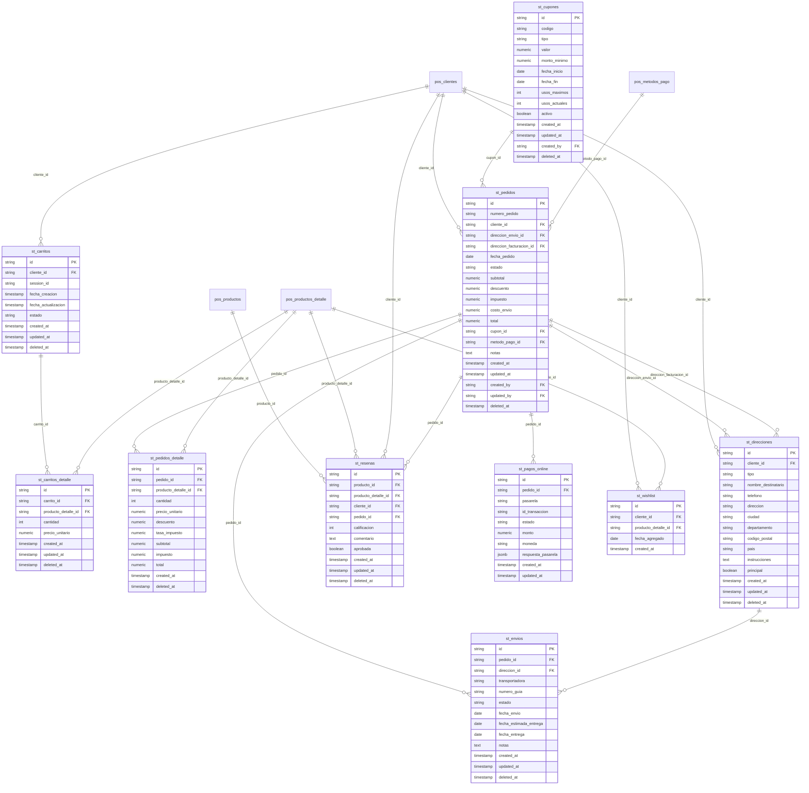

# Especificación del Módulo Tienda Virtual - Kubit

## 1. Descripción General
El módulo **Store (Tienda Virtual)** es el componente de comercio electrónico del ecosistema Kubit. Permite la venta de productos a través de un catálogo público en línea, con carrito de compras, checkout, procesamiento de pagos y gestión de pedidos.

### 1.1 Alcance Funcional
- Catálogo de productos público con búsqueda y filtros
- Carrito de compras (persistente para registrados, localStorage para invitados)
- Checkout con y sin registro (guest checkout)
- Pasarela de pagos integrada
- Gestión de pedidos y seguimiento de envíos
- Panel de cliente (historial de pedidos, direcciones, wishlist)
- Cupones de descuento
- Reseñas y calificaciones de productos
- Lista de deseos (wishlist)
- SEO (URLs amigables, meta tags, sitemap)

### 1.2 Dependencias
- **Base de datos:** PostgreSQL vía Supabase (esquemas `pos_*` + `st_*`)
- **UI/UX:** Sistema de diseño definido en `05-ui-ux-system.md`
- **Arquitectura:** Estructura definida en `ARCHITECTURE.md`
- **Módulo POS:** Productos, categorías, clientes, métodos de pago y configuración se comparten desde `pos_*`
- **Pasarela de pagos:** API externa (definir en integraciones)

---

## 2. Modelo de Datos

### 2.1 Convenciones Generales
- **Prefijo:** Tablas de la tienda usan prefijo `st_`; tablas compartidas usan `pos_`
- **Primary Key:** `id` tipo `string` (UUID v4)
- **Timestamps:** `created_at` y `updated_at` tipo `timestamptz`
- **Soft Delete:** `deleted_at` nullable (`timestamptz`)
- **Auditoría:** `created_by` y `updated_by` como FK a `pos_usuarios`
- **Moneda:** Todos los montos son `numeric`
- **Índices:** Todas las FK deben tener índice para rendimiento en JOINs

### 2.2 Tablas Compartidas con POS (`pos_*`)

| Tabla | Uso en Store |
|---|---|
| `pos_productos` | Catálogo de productos (nombre, descripción, impuesto, marca, modelo) |
| `pos_productos_detalle` | Variantes del producto (precios, stock, código barras, imágenes) |
| `pos_productos_multimedia` | Imágenes y galería multimedia del catálogo |
| `pos_categorias` | Árbol de categorías para navegación y filtros |
| `pos_clientes` | Cuentas de clientes registrados en la tienda |
| `pos_metodos_pago` | Métodos de pago habilitados para el checkout |
| `pos_configuracion_empresa` | Información legal, términos, logo, redes sociales |
| `pos_usuarios` | Usuarios administradores de la tienda |
| `pos_roles` | Roles del sistema (administrador, moderador de reseñas) |
| `pos_rol_permisos` | Permisos para gestión de tienda |

### 2.3 Tablas Exclusivas del Store (`st_*`)

| Tabla | Propósito |
|---|---|
| `st_carritos` | Carritos de compra activos asociados a sesión o cliente |
| `st_carritos_detalle` | Productos agregados al carrito con cantidades |
| `st_pedidos` | Órdenes de compra realizadas |
| `st_pedidos_detalle` | Líneas de detalle de cada pedido |
| `st_direcciones` | Direcciones de envío y facturación de clientes |
| `st_envios` | Seguimiento de envíos con estado y número de tracking |
| `st_cupones` | Cupones de descuento con reglas de aplicación |
| `st_resenas` | Reseñas y calificaciones de productos |
| `st_pagos_online` | Transacciones contra la pasarela de pago |
| `st_wishlist` | Listas de deseos de los clientes |

### 2.4 Diagrama Entidad-Relación



### 2.5 Catálogo Detallado de Tablas `st_*`

#### 2.5.1 `st_carritos`
| Campo | Tipo | Descripción |
|---|---|---|
| `id` | string PK | UUID |
| `cliente_id` | string FK | Cliente registrado (null si es guest) |
| `session_id` | string | ID de sesión para carritos de invitados |
| `fecha_creacion` | timestamp | Momento de creación del carrito |
| `fecha_actualizacion` | timestamp | Última modificación |
| `estado` | string | `ACTIVO`, `CONVERTIDO`, `ABANDONADO` |
| `created_at` | timestamp | Auditoría |
| `updated_at` | timestamp | Auditoría |
| `deleted_at` | timestamp | Soft delete |

**Reglas:**
- Un carrito pertenece a un cliente registrado O a una sesión de invitado (nunca ambos vacíos)
- Estado `CONVERTIDO` cuando el carrito se transforma en pedido
- Estado `ABANDONADO` si no hay actividad por más de 7 días (para campañas de recuperación)

#### 2.5.2 `st_carritos_detalle`
| Campo | Tipo | Descripción |
|---|---|---|
| `id` | string PK | UUID |
| `carrito_id` | string FK | Carrito al que pertenece |
| `producto_detalle_id` | string FK | Variante del producto |
| `cantidad` | int | Cantidad seleccionada |
| `precio_unitario` | numeric | Precio al momento de agregar (snapshot) |
| `created_at` | timestamp | Auditoría |
| `updated_at` | timestamp | Auditoría |
| `deleted_at` | timestamp | Soft delete |

**Reglas:**
- `cantidad` debe ser > 0
- El `precio_unitario` se congela al agregar al carrito (no cambia si el precio sube después)
- Se valida `stock_actual` en `pos_productos_detalle` al momento de checkout

#### 2.5.3 `st_pedidos`
| Campo | Tipo | Descripción |
|---|---|---|
| `id` | string PK | UUID |
| `numero_pedido` | string | Correlativo público (ej. `KBT-202605-0001`) |
| `cliente_id` | string FK | Cliente que realizó el pedido |
| `direccion_envio_id` | string FK | Dirección de envío seleccionada |
| `direccion_facturacion_id` | string FK | Dirección fiscal |
| `fecha_pedido` | date | Fecha del pedido |
| `estado` | string | Ver ciclo de vida abajo |
| `subtotal` | numeric | Suma de subtotales del detalle |
| `descuento` | numeric | Descuento total aplicado |
| `impuesto` | numeric | Impuesto total |
| `costo_envio` | numeric | Costo del envío |
| `total` | numeric | Total final = subtotal - descuento + impuesto + costo_envio |
| `cupon_id` | string FK | Cupón aplicado (opcional) |
| `metodo_pago_id` | string FK | Método de pago seleccionado |
| `notas` | text | Notas del cliente |
| `created_at` | timestamp | Auditoría |
| `updated_at` | timestamp | Auditoría |
| `created_by` | string FK | Auditoría |
| `updated_by` | string FK | Auditoría |
| `deleted_at` | timestamp | Soft delete |

**Ciclo de vida del pedido:**
```
PENDIENTE → PAGADO → CONFIRMADO → ENVIADO → ENTREGADO
                    → CANCELADO
                              → DEVUELTO
```

| Estado | Descripción |
|---|---|
| `PENDIENTE` | Pedido creado, esperando pago |
| `PAGADO` | Pago confirmado por la pasarela |
| `CONFIRMADO` | Aceptado por el vendedor, preparándose |
| `ENVIADO` | Despachado con guía de seguimiento |
| `ENTREGADO` | Confirmación de entrega |
| `CANCELADO` | Cancelado antes del envío (reversión de inventario) |
| `DEVUELTO` | Devolución después de entregado |

#### 2.5.4 `st_pedidos_detalle`
| Campo | Tipo | Descripción |
|---|---|---|
| `id` | string PK | UUID |
| `pedido_id` | string FK | Pedido al que pertenece |
| `producto_detalle_id` | string FK | Variante del producto |
| `cantidad` | int | Cantidad comprada |
| `precio_unitario` | numeric | Precio al momento de la compra |
| `descuento` | numeric | Descuento aplicado al ítem |
| `tasa_impuesto` | numeric | % de impuesto aplicado |
| `subtotal` | numeric | subtotal = (cantidad * precio_unitario) - descuento |
| `impuesto` | numeric | impuesto = subtotal * tasa_impuesto |
| `total` | numeric | total = subtotal + impuesto |
| `created_at` | timestamp | Auditoría |
| `deleted_at` | timestamp | Soft delete |

#### 2.5.5 `st_direcciones`
| Campo | Tipo | Descripción |
|---|---|---|
| `id` | string PK | UUID |
| `cliente_id` | string FK | Cliente propietario |
| `tipo` | string | `envio`, `facturacion`, `ambas` |
| `nombre_destinatario` | string | Nombre de quien recibe |
| `telefono` | string | Teléfono de contacto |
| `direccion` | string | Dirección completa (calle, número, barrio) |
| `ciudad` | string | Ciudad |
| `departamento` | string | Departamento/Estado |
| `codigo_postal` | string | Código postal |
| `pais` | string | País (default: Colombia) |
| `instrucciones` | text | Instrucciones de entrega |
| `principal` | boolean | Dirección por defecto del cliente |
| `created_at` | timestamp | Auditoría |
| `updated_at` | timestamp | Auditoría |
| `deleted_at` | timestamp | Soft delete |

#### 2.5.6 `st_envios`
| Campo | Tipo | Descripción |
|---|---|---|
| `id` | string PK | UUID |
| `pedido_id` | string FK | Pedido asociado |
| `direccion_id` | string FK | Dirección de entrega |
| `transportadora` | string | Nombre de la transportadora (Coordinadora, Servientrega, etc.) |
| `numero_guia` | string | Número de guía de seguimiento |
| `estado` | string | `PREPARACION`, `DESPACHADO`, `EN_TRANSITO`, `ENTREGADO`, `FALLIDO` |
| `fecha_envio` | date | Fecha de despacho |
| `fecha_estimada_entrega` | date | Fecha estimada |
| `fecha_entrega` | date | Fecha real de entrega |
| `notas` | text | Novedades del envío |
| `created_at` | timestamp | Auditoría |
| `updated_at` | timestamp | Auditoría |
| `deleted_at` | timestamp | Soft delete |

#### 2.5.7 `st_cupones`
| Campo | Tipo | Descripción |
|---|---|---|
| `id` | string PK | UUID |
| `codigo` | string | Código promocional (ej. `BIENVENIDO10`) |
| `tipo` | string | `porcentaje`, `monto_fijo`, `envio_gratis` |
| `valor` | numeric | Valor del descuento (10 = 10% o $10.000 según tipo) |
| `monto_minimo` | numeric | Monto mínimo de compra para aplicar |
| `fecha_inicio` | date | Inicio de vigencia |
| `fecha_fin` | date | Fin de vigencia |
| `usos_maximos` | int | Límite de usos totales (0 = ilimitado) |
| `usos_actuales` | int | Contador de usos |
| `activo` | boolean | Si el cupón está habilitado |
| `created_at` | timestamp | Auditoría |
| `updated_at` | timestamp | Auditoría |
| `created_by` | string FK | Quién creó el cupón |
| `deleted_at` | timestamp | Soft delete |

**Reglas:**
- Un cupón vence si `fecha_fin < today()` o `usos_actuales >= usos_maximos`
- `monto_minimo` se valida contra el subtotal del carrito
- No se pueden combinar cupones en un mismo pedido
- El código debe ser único (UK)

#### 2.5.8 `st_resenas`
| Campo | Tipo | Descripción |
|---|---|---|
| `id` | string PK | UUID |
| `producto_id` | string FK | Producto calificado |
| `producto_detalle_id` | string FK | Variante específica (opcional) |
| `cliente_id` | string FK | Cliente que reseña |
| `pedido_id` | string FK | Pedido asociado (verifica compra real) |
| `calificacion` | int | 1 a 5 estrellas |
| `comentario` | text | Texto de la reseña |
| `aprobada` | boolean | Aprobada por moderación (default: false) |
| `created_at` | timestamp | Auditoría |
| `updated_at` | timestamp | Auditoría |
| `deleted_at` | timestamp | Soft delete |

**Reglas:**
- Solo clientes con pedido `ENTREGADO` del producto pueden reseñar
- Una reseña por cliente por producto (si ya existe, se actualiza)
- Las reseñas no aprobadas no se muestran en el catálogo
- La calificación promedio del producto se calcula en consulta (no se almacena)

#### 2.5.9 `st_pagos_online`
| Campo | Tipo | Descripción |
|---|---|---|
| `id` | string PK | UUID |
| `pedido_id` | string FK | Pedido asociado |
| `pasarela` | string | Nombre de la pasarela (Wompi, PayU, MercadoPago, etc.) |
| `id_transaccion` | string | ID único de la transacción en la pasarela |
| `estado` | string | `PENDIENTE`, `APROBADO`, `RECHAZADO`, `REEMBOLSADO`, `FALLIDO` |
| `monto` | numeric | Monto de la transacción |
| `moneda` | string | Código de moneda (COP, USD) |
| `respuesta_pasarela` | jsonb | Payload completo de respuesta de la pasarela |
| `created_at` | timestamp | Auditoría |
| `updated_at` | timestamp | Auditoría |

**Reglas:**
- Un pedido puede tener múltiples intentos de pago, pero solo uno con estado `APROBADO`
- `respuesta_pasarela` almacena el JSON crudo para depuración y reembolsos
- Si el pago es `RECHAZADO`, el pedido permanece `PENDIENTE` para reintento

#### 2.5.10 `st_wishlist`
| Campo | Tipo | Descripción |
|---|---|---|
| `id` | string PK | UUID |
| `cliente_id` | string FK | Cliente |
| `producto_detalle_id` | string FK | Variante del producto |
| `fecha_agregado` | date | Fecha en que se agregó |
| `created_at` | timestamp | Auditoría |

**Reglas:**
- Combinación `(cliente_id, producto_detalle_id)` debe ser única
- Si el producto se elimina o desactiva, se muestra como "no disponible" en la lista
- Se puede enviar notificación al cliente si el producto baja de precio o vuelve a stock

---

## 3. Reglas de Negocio

### 3.1 Catálogo

1. Solo se muestran productos con `activo = true` en `pos_productos`
2. Solo se muestran variantes con `stock_actual > 0` (configurable: mostrar agotados)
3. El precio de lista es `precio_venta` de `pos_productos_detalle`
4. El precio mayorista (`precio_mayorista`) se muestra si el cliente supera una cantidad mínima definida por el administrador
5. Las categorías jerárquicas se navegan desde `pos_categorias.categoria_padre_id`
6. La imagen principal del producto es el registro `pos_productos_multimedia` con `orden = 0`

### 3.2 Carrito de Compras

1. **Invitados:** El carrito se asocia a `session_id` (generado por el frontend) y se persiste en localStorage + DB
2. **Registrados:** El carrito se asocia a `cliente_id` y se sincroniza entre dispositivos
3. **Al iniciar sesión:** Si el invitado tenía items en el carrito y el cliente no tiene carrito activo, se migra el carrito de invitado al cliente
4. **Stock:** Al agregar al carrito se muestra disponibilidad, pero la validación firme ocurre en checkout
5. **Precio:** Se congela al agregar. Si el precio cambia después, se notifica al cliente antes de checkout
6. **Abandono:** Carritos sin actividad por 7 días pasan a `ABANDONADO`. Se pueden enviar correos de recuperación

### 3.3 Checkout

1. Se requiere al menos: dirección de envío, método de pago y aceptación de términos
2. El guest checkout captura email, nombre y dirección sin crear cuenta completa en `pos_clientes`
3. Al confirmar el pedido:
   - Se crea el registro en `st_pedidos` con estado `PENDIENTE`
   - El carrito pasa a estado `CONVERTIDO`
   - Se envía al cliente a la pasarela de pago
4. Si el pago es `APROBADO`:
   - Pedido pasa a `PAGADO`
   - Se descuenta inventario de `pos_productos_detalle.stock_actual`
   - Se genera movimiento en `pos_movimientos_inventario` (tipo `salida_venta`)
   - Se envía confirmación por email
5. Si el pago es `RECHAZADO`:
   - Pedido permanece `PENDIENTE`
   - Se notifica al cliente para reintentar

### 3.4 Gestión de Pedidos (Admin)

1. El administrador puede cambiar el estado del pedido manualmente
2. Al pasar a `ENVIADO`: se requiere `numero_guia` y `transportadora` en `st_envios`
3. Al pasar a `ENTREGADO`: se registra `fecha_entrega`
4. Al cancelar un pedido `PAGADO`:
   - Se revierte el inventario (movimiento `devolucion_venta`)
   - Se procesa reembolso en la pasarela
5. Al registrar devolución (`DEVUELTO`):
   - Se revierte el inventario
   - Se procesa reembolso parcial o total

### 3.5 Cupones

1. Se validan en orden: vigencia → usos → monto mínimo → aplicabilidad
2. Cupón tipo `porcentaje`: descuento = subtotal * (valor / 100)
3. Cupón tipo `monto_fijo`: descuento = valor (sin exceder subtotal)
4. Cupón tipo `envio_gratis`: costo_envio = 0
5. Una vez aplicado a un pedido, se incrementa `usos_actuales`

### 3.6 Reseñas

1. Solo se puede reseñar después de que el pedido está `ENTREGADO`
2. La reseña aparece en el catálogo solo después de `aprobada = true`
3. La calificación promedio se calcula como `AVG(calificacion)` en la consulta
4. El cliente puede actualizar su reseña (se conserva la última versión con su `updated_at`)
5. El administrador puede eliminar reseñas (soft delete)

### 3.7 Integración con POS (Stock en Tiempo Real)

- El stock (`pos_productos_detalle.stock_actual`) es la fuente única de verdad
- El Store consulta el stock directamente de la tabla compartida
- Al confirmar un pago online, el descuento de inventario es inmediato
- Si hay una venta POS simultánea que deja el stock en 0, el Store lo refleja en la siguiente consulta

---

## 4. Flujos del Sistema

### 4.1 Flujo de Compra Completo (Cliente)
```
Cliente navega catálogo → Agrega productos al carrito →
  → Inicia sesión o continúa como invitado →
  → Checkout: selecciona dirección de envío →
  → Aplica cupón (opcional) → Selecciona método de pago →
  → Confirma pedido → Es redirigido a pasarela de pago →
  → Pago exitoso:
      → Pedido → PAGADO
      → Descuento de inventario
      → Email de confirmación
  → Pago fallido:
      → Pedido → PENDIENTE
      → Notificación de error → Reintento
```

### 4.2 Flujo de Post-Compra (Admin)
```
Admin ve pedido PAGADO → Prepara productos →
  → Registra envío con transportadora y guía →
  → Pedido → ENVIADO → Cliente recibe notificación →
  → Cliente confirma recepción o pasa el plazo →
  → Pedido → ENTREGADO
```

### 4.3 Flujo de Devolución
```
Cliente solicita devolución → Admin revisa y aprueba →
  → Genera guía de devolución →
  → Recibe producto → Verifica estado →
  → Pedido → DEVUELTO
  → Revierte inventario
  → Procesa reembolso
```

---

## 5. Seguridad y Control de Acceso

### 5.1 Roles para Store

| Rol | Permisos |
|---|---|
| `admin` | Gestión total de la tienda (pedidos, productos, cupones, reseñas) |
| `moderador` | Moderar reseñas, gestionar pedidos |
| `vendedor_online` | Ver pedidos, actualizar estado de envíos |
| `cliente` | Ver catálogo, comprar, reseñar (vía RLS, no por rol de DB) |

### 5.2 Reglas de Seguridad
1. Los clientes solo ven sus propios pedidos, direcciones y wishlist (RLS por `cliente_id`)
2. Las reseñas requieren un pedido verificado (`pedido_id` existente y entregado)
3. Los cupones son gestionados solo por administradores
4. El carrito de un cliente solo es accesible por ese cliente
5. El guest checkout crea un registro mínimo en `pos_clientes` sin contraseña

---

## 6. Integraciones

### 6.1 Con POS
| Dirección | Qué sincroniza | Frecuencia |
|---|---|---|
| POS → Store | Productos, categorías, precios, stock | Tiempo real (misma DB) |
| Store → POS | Ventas online como movimientos de inventario | Al confirmar pago |
| Store → POS | Nuevos clientes registrados | Inmediato |
| POS → Store | Actualizaciones de precio, descuentos | Tiempo real |

### 6.2 Pasarela de Pagos
- **Endpoint de confirmación (webhook):** Recibe la respuesta de la pasarela y actualiza `st_pagos_online.estado`
- **Reintentos:** El sistema permite al cliente reintentar el pago hasta 3 veces
- **Reembolsos:** Se procesan desde el panel de administración, registrando en `st_pagos_online`

### 6.3 Logística
- Integración con APIs de transportadoras colombianas (Coordinadora, Servientrega, Inter Rapidísimo)
- Los estados de envío se actualizan automáticamente vía webhook o polling

### 6.4 Notificaciones
| Evento | Canal |
|---|---|
| Pedido confirmado | Email + WhatsApp |
| Pago aprobado | Email |
| Pedido enviado | Email + SMS con guía |
| Pedido entregado | Email |
| Carrito abandonado | Email (3 días sin actividad) |
| Cupón próximo a vencer | Email |

---

## 7. UX/UI Específica

### 7.1 Páginas del Store

| Ruta | Descripción |
|---|---|
| `/` | Home con productos destacados y categorías |
| `/catalogo` | Catálogo completo con filtros |
| `/categoria/{slug}` | Productos por categoría |
| `/producto/{slug}` | Detalle del producto con galería y reseñas |
| `/carrito` | Carrito de compras |
| `/checkout` | Proceso de pago |
| `/cuenta/pedidos` | Historial de pedidos del cliente |
| `/cuenta/direcciones` | Direcciones guardadas |
| `/cuenta/wishlist` | Lista de deseos |
| `/buscar?q=` | Resultados de búsqueda |

### 7.2 Componentes Clave
- **Header:** Logo, buscador, carrito (con badge de cantidad), menú de categorías, botón de inicio de sesión
- **Galería de producto:** Imagen principal + thumbnails, zoom al hover
- **Selector de variante:** Según atributos JSONB (talla, color, etc.)
- **Carrito lateral (slide-over):** Accesible desde cualquier página
- **Checkout en 3 pasos:** Dirección → Pago → Confirmación

### 7.3 SEO
- URLs amigables con slugs generados del nombre del producto
- Meta tags (title, description, og:image) por producto y categoría
- Sitemap XML generado dinámicamente
- Schema.org (Product, Organization, BreadcrumbList)

### 7.4 PWA
- Instalable en dispositivos iOS, Android y escritorio
- Modo offline parcial (catálogo en caché, carrito local)
- Notificaciones push para cambios de estado del pedido

---

## 8. Validaciones de Datos

### 8.1 Campos Requeridos

| Tabla | Campos Requeridos |
|---|---|
| `st_pedidos` | `cliente_id`, `fecha_pedido`, `total`, `metodo_pago_id` |
| `st_pedidos_detalle` | `pedido_id`, `producto_detalle_id`, `cantidad`, `precio_unitario` |
| `st_direcciones` | `cliente_id`, `direccion`, `ciudad`, `departamento` |
| `st_envios` | `pedido_id`, `transportadora`, `numero_guia` |
| `st_cupones` | `codigo`, `tipo`, `valor` |
| `st_resenas` | `producto_id`, `cliente_id`, `pedido_id`, `calificacion` |
| `st_pagos_online` | `pedido_id`, `pasarela`, `id_transaccion`, `monto` |
| `st_wishlist` | `cliente_id`, `producto_detalle_id` |

### 8.2 Valores por Defecto

| Campo | Default |
|---|---|
| `st_carritos.estado` | `ACTIVO` |
| `st_pedidos.estado` | `PENDIENTE` |
| `st_envios.estado` | `PREPARACION` |
| `st_cupones.activo` | `true` |
| `st_resenas.aprobada` | `false` |
| `st_pagos_online.estado` | `PENDIENTE` |
| `st_direcciones.pais` | `Colombia` |
| `st_direcciones.principal` | `false` |

---

## 9. Glosario

| Término | Definición |
|---|---|
| **Guest Checkout** | Compra sin registro, solo con datos mínimos |
| **Pasarela de Pago** | Servicio externo que procesa transacciones (Wompi, MercadoPago) |
| **SKU** | Stock Keeping Unit (identificador interno de variante) |
| **Webhook** | Llamada HTTP automática de la pasarela al confirmar un pago |
| **RLS** | Row-Level Security (PostgreSQL) |
| **PWA** | Progressive Web App |
| **SEO** | Search Engine Optimization |
